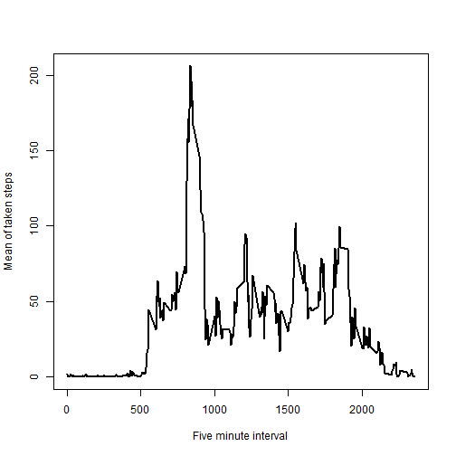
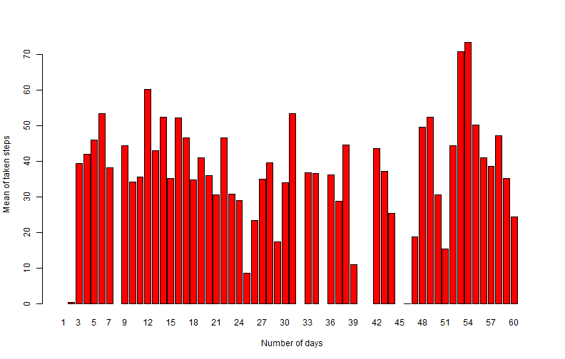
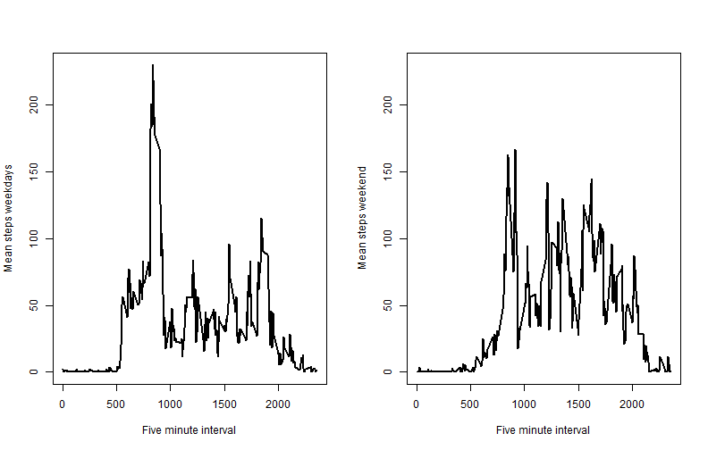

Monitoring of daily activity
============================
### Coursera course: Reproducible Research, Project 1
### Date: 13-06-2014
### Author: Wai-Wah Liu

First set working directory

```r
setwd("H:\\Coursera\\Data Science Track\\05_Reproducible Research\\week 2\\RepData_PeerAssessment1\\RepData_PeerAssessment1\\activity")
```

Read in dataset

```r
act <- read.csv("H:\\Coursera\\Data Science Track\\05_Reproducible Research\\week 2\\RepData_PeerAssessment1\\RepData_PeerAssessment1\\activity\\activity.csv", 
    sep = ",", header = TRUE, na.strings = "NA")
```

convert date to date format 

```r
act$date <- as.Date(as.character(act$date, format = "%Y-%m-%d"))
```

Add a day variable

```r
act$day <- as.numeric(format(act$date, "%d"))
act$day[act$date >= "2012-11-01"] <- act$day[act$date >= "2012-11-01"] + 31
```


#### 1. Make a histogram of the total number of steps taken each day
First calculate total number of steps per day

```r
sumOfSteps <- aggregate(act$steps, list(act$day), FUN = "sum")
```

Plot the histogram

```r
barplot(sumOfSteps[, 2], names.arg = 1:61, xlab = "Number of days", ylab = "Sum of taken steps", 
    col = "red")
```

 

#### 2. Calculate and report the mean and median total number of steps taken per day

```r
meanSteps <- aggregate(act$steps, list(act$day), FUN = "mean")
colnames(meanSteps)[1] <- "Day"
colnames(meanSteps)[2] <- "Mean"
print(meanSteps, row.names = FALSE)
```

```
##  Day    Mean
##    1      NA
##    2  0.4375
##    3 39.4167
##    4 42.0694
##    5 46.1597
##    6 53.5417
##    7 38.2465
##    8      NA
##    9 44.4826
##   10 34.3750
##   11 35.7778
##   12 60.3542
##   13 43.1458
##   14 52.4236
##   15 35.2049
##   16 52.3750
##   17 46.7083
##   18 34.9167
##   19 41.0729
##   20 36.0938
##   21 30.6285
##   22 46.7361
##   23 30.9653
##   24 29.0104
##   25  8.6528
##   26 23.5347
##   27 35.1354
##   28 39.7847
##   29 17.4236
##   30 34.0938
##   31 53.5208
##   32      NA
##   33 36.8056
##   34 36.7049
##   35      NA
##   36 36.2465
##   37 28.9375
##   38 44.7326
##   39 11.1771
##   40      NA
##   41      NA
##   42 43.7778
##   43 37.3785
##   44 25.4722
##   45      NA
##   46  0.1424
##   47 18.8924
##   48 49.7882
##   49 52.4653
##   50 30.6979
##   51 15.5278
##   52 44.3993
##   53 70.9271
##   54 73.5903
##   55 50.2708
##   56 41.0903
##   57 38.7569
##   58 47.3819
##   59 35.3576
##   60 24.4688
##   61      NA
```


```r
medianSteps <- aggregate(act$steps, list(act$day), FUN = "median")
colnames(medianSteps)[1] <- "Day"
colnames(medianSteps)[2] <- "Median"
print(medianSteps, row.names = FALSE)
```

```
##  Day Median
##    1     NA
##    2      0
##    3      0
##    4      0
##    5      0
##    6      0
##    7      0
##    8     NA
##    9      0
##   10      0
##   11      0
##   12      0
##   13      0
##   14      0
##   15      0
##   16      0
##   17      0
##   18      0
##   19      0
##   20      0
##   21      0
##   22      0
##   23      0
##   24      0
##   25      0
##   26      0
##   27      0
##   28      0
##   29      0
##   30      0
##   31      0
##   32     NA
##   33      0
##   34      0
##   35     NA
##   36      0
##   37      0
##   38      0
##   39      0
##   40     NA
##   41     NA
##   42      0
##   43      0
##   44      0
##   45     NA
##   46      0
##   47      0
##   48      0
##   49      0
##   50      0
##   51      0
##   52      0
##   53      0
##   54      0
##   55      0
##   56      0
##   57      0
##   58      0
##   59      0
##   60      0
##   61     NA
```

#### 3. Make a time series plot (i.e. type = "l") of the 5-minute interval (x-axis) and the average number of steps taken, averaged across all days (y-axis)
Calculate and plot average steps across all days by interval

```r
grandMeanSteps <- aggregate(act$steps, list(act$interval), FUN = "mean", na.rm = TRUE)
colnames(grandMeanSteps)[1] <- "Interval"
colnames(grandMeanSteps)[2] <- "Mean"
plot(grandMeanSteps, type = "l", xlab = "Five minute interval", ylab = "Mean of taken steps", 
    lwd = 2)
```

 


#### 4. Which 5-minute interval, on average across all the days in the dataset, contains the maximum number of steps?

```r
maxStep <- grandMeanSteps[which.max(grandMeanSteps[, 2]), 1]
print(maxStep)
```

```
## [1] 835
```


#### 5. Calculate and report the total number of missing values in the dataset (i.e. the total number of rows with NAs)

```r
table(is.na(act$steps))
```

```
## 
## FALSE  TRUE 
## 15264  2304
```

```r
print("There are 2304 rows with NAs")
```

```
## [1] "There are 2304 rows with NAs"
```

#### 6. Devise a strategy for filling in all of the missing values in the dataset. The strategy does not need to be sophisticated.
The grand mean of steps per time interval is already calculated. So these values will be used to replace missing values.

#### 7. Create a new dataset that is equal to the original dataset but with the missing data filled in.
Make copy of the original dataset and fill in missing values

```r
actNAreplace <- act

for (i in 1:nrow(actNAreplace)) {
    if (is.na(actNAreplace$steps[i])) 
        actNAreplace$steps[i] <- grandMeanSteps$Mean[grandMeanSteps$Interval == 
            actNAreplace$interval[i]]
}

print(actNAreplace[1:10, ])
```

```
##      steps       date interval day
## 1  1.71698 2012-10-01        0   1
## 2  0.33962 2012-10-01        5   1
## 3  0.13208 2012-10-01       10   1
## 4  0.15094 2012-10-01       15   1
## 5  0.07547 2012-10-01       20   1
## 6  2.09434 2012-10-01       25   1
## 7  0.52830 2012-10-01       30   1
## 8  0.86792 2012-10-01       35   1
## 9  0.00000 2012-10-01       40   1
## 10 1.47170 2012-10-01       45   1
```


#### 8. Make a histogram of the total number of steps taken each day and Calculate and report the mean and median total number of steps taken per day. Do these values differ from the estimates from the first part of the assignment? What is the impact of imputing missing data on the estimates of the total daily number of steps?
Calculate and report new means and medians

```r
meanSteps2 <- aggregate(actNAreplace$steps, list(actNAreplace$day), FUN = "mean")
colnames(meanSteps2)[1] <- "Day"
colnames(meanSteps2)[2] <- "Mean"
print(meanSteps2, row.names = FALSE)
```

```
##  Day    Mean
##    1 37.3826
##    2  0.4375
##    3 39.4167
##    4 42.0694
##    5 46.1597
##    6 53.5417
##    7 38.2465
##    8 37.3826
##    9 44.4826
##   10 34.3750
##   11 35.7778
##   12 60.3542
##   13 43.1458
##   14 52.4236
##   15 35.2049
##   16 52.3750
##   17 46.7083
##   18 34.9167
##   19 41.0729
##   20 36.0938
##   21 30.6285
##   22 46.7361
##   23 30.9653
##   24 29.0104
##   25  8.6528
##   26 23.5347
##   27 35.1354
##   28 39.7847
##   29 17.4236
##   30 34.0938
##   31 53.5208
##   32 37.3826
##   33 36.8056
##   34 36.7049
##   35 37.3826
##   36 36.2465
##   37 28.9375
##   38 44.7326
##   39 11.1771
##   40 37.3826
##   41 37.3826
##   42 43.7778
##   43 37.3785
##   44 25.4722
##   45 37.3826
##   46  0.1424
##   47 18.8924
##   48 49.7882
##   49 52.4653
##   50 30.6979
##   51 15.5278
##   52 44.3993
##   53 70.9271
##   54 73.5903
##   55 50.2708
##   56 41.0903
##   57 38.7569
##   58 47.3819
##   59 35.3576
##   60 24.4688
##   61 37.3826
```


```r
medianSteps2 <- aggregate(actNAreplace$steps, list(actNAreplace$day), FUN = "median")
colnames(medianSteps2)[1] <- "Day"
colnames(medianSteps2)[2] <- "Median"
print(medianSteps2, row.names = FALSE)
```

```
##  Day Median
##    1  34.11
##    2   0.00
##    3   0.00
##    4   0.00
##    5   0.00
##    6   0.00
##    7   0.00
##    8  34.11
##    9   0.00
##   10   0.00
##   11   0.00
##   12   0.00
##   13   0.00
##   14   0.00
##   15   0.00
##   16   0.00
##   17   0.00
##   18   0.00
##   19   0.00
##   20   0.00
##   21   0.00
##   22   0.00
##   23   0.00
##   24   0.00
##   25   0.00
##   26   0.00
##   27   0.00
##   28   0.00
##   29   0.00
##   30   0.00
##   31   0.00
##   32  34.11
##   33   0.00
##   34   0.00
##   35  34.11
##   36   0.00
##   37   0.00
##   38   0.00
##   39   0.00
##   40  34.11
##   41  34.11
##   42   0.00
##   43   0.00
##   44   0.00
##   45  34.11
##   46   0.00
##   47   0.00
##   48   0.00
##   49   0.00
##   50   0.00
##   51   0.00
##   52   0.00
##   53   0.00
##   54   0.00
##   55   0.00
##   56   0.00
##   57   0.00
##   58   0.00
##   59   0.00
##   60   0.00
##   61  34.11
```

Plot the new histogram

```r
barplot(meanSteps[, 2], names.arg = 1:61, xlab = "Number of days", ylab = "Mean of taken steps", 
    col = "red")
```

 

Differences of means and medians

```r
meanSteps[, 2] - meanSteps2[, 2]
```

```
##  [1] NA  0  0  0  0  0  0 NA  0  0  0  0  0  0  0  0  0  0  0  0  0  0  0
## [24]  0  0  0  0  0  0  0  0 NA  0  0 NA  0  0  0  0 NA NA  0  0  0 NA  0
## [47]  0  0  0  0  0  0  0  0  0  0  0  0  0  0 NA
```

```r
medianSteps[, 2] - medianSteps2[, 2]
```

```
##  [1] NA  0  0  0  0  0  0 NA  0  0  0  0  0  0  0  0  0  0  0  0  0  0  0
## [24]  0  0  0  0  0  0  0  0 NA  0  0 NA  0  0  0  0 NA NA  0  0  0 NA  0
## [47]  0  0  0  0  0  0  0  0  0  0  0  0  0  0 NA
```

As can be seen the new means and medians only effect entire days because only steps from entire days are missing

```r
print(mean(meanSteps[, 2], na.rm = TRUE) - mean(meanSteps2[, 2]), digits = 3)
```

```
## [1] 0
```

```r
mean(medianSteps[, 2], na.rm = TRUE) - mean(medianSteps2[, 2])
```

```
## [1] -4.474
```

The new means and median seem to have no effect for the mean (which is somehow exactly zero). However the new medians will cause the average median to go up because old value minus new value is a negative number.

#### 9. Create a new factor variable in the dataset with two levels - "weekday" and "weekend" indicating whether a given date is a weekday or weekend day.

```r
actNAreplace$actualDay <- weekdays(actNAreplace$date)

NonWeekend <- c("maandag", "dinsdag", "woensdag", "donderdag", "vrijdag")
Weekend <- c("zaterdag", "zondag")

actNAreplace$weekday[actNAreplace$actualDay %in% NonWeekend] <- 1
actNAreplace$weekday[actNAreplace$actualDay %in% Weekend] <- 2
actNAreplace$weekday <- factor(actNAreplace$weekday, levels = 1:2, labels = c("Weekday", 
    "Weekend"))

str(actNAreplace)
```

```
## 'data.frame':	17568 obs. of  6 variables:
##  $ steps    : num  1.717 0.3396 0.1321 0.1509 0.0755 ...
##  $ date     : Date, format: "2012-10-01" "2012-10-01" ...
##  $ interval : int  0 5 10 15 20 25 30 35 40 45 ...
##  $ day      : num  1 1 1 1 1 1 1 1 1 1 ...
##  $ actualDay: chr  "maandag" "maandag" "maandag" "maandag" ...
##  $ weekday  : Factor w/ 2 levels "Weekday","Weekend": 1 1 1 1 1 1 1 1 1 1 ...
```

#### 10. Make a panel plot containing a time series plot (i.e. type = "l") of the 5-minute interval (x-axis) and the average number of steps taken, averaged across all weekday days or weekend days (y-axis).
Calculate and average steps across weekdays by interval

```r
grandMeanWeek <- aggregate(actNAreplace$steps[actNAreplace$weekday == "Weekday"], 
    list(actNAreplace$interval[actNAreplace$weekday == "Weekday"]), FUN = "mean", 
    na.rm = TRUE)
colnames(grandMeanWeek)[1] <- "Interval"
colnames(grandMeanWeek)[2] <- "Mean"
```

Calculate and average steps across weekend by interval

```r
grandMeanWeekend <- aggregate(actNAreplace$steps[actNAreplace$weekday == "Weekend"], 
    list(actNAreplace$interval[actNAreplace$weekday == "Weekend"]), FUN = "mean", 
    na.rm = TRUE)
colnames(grandMeanWeekend)[1] <- "Interval"
colnames(grandMeanWeekend)[2] <- "Mean"
```

Plot the figure

```r
par(mfrow = c(1, 2))

plot(grandMeanWeek, type = "l", xlab = "Five minute interval", ylab = "Mean steps weekdays", 
    ylim = c(0, 230), lwd = 2)

plot(grandMeanWeekend, type = "l", xlab = "Five minute interval", ylab = "Mean steps weekend", 
    ylim = c(0, 230), lwd = 2)
```

 

